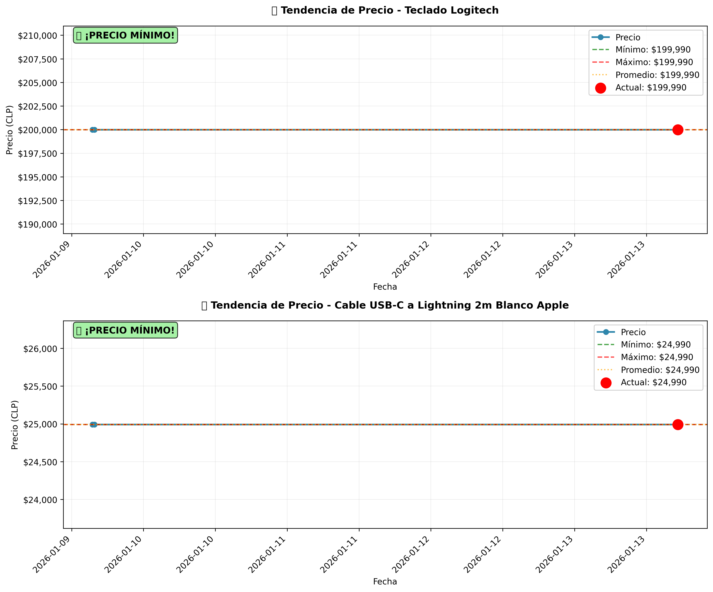
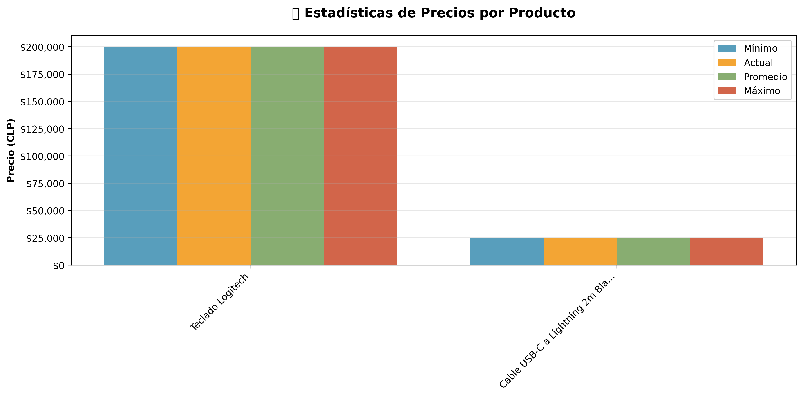

# 🇨🇱 Chile Tech Price Tracker

Rastreador automático de precios de tecnología en tiendas chilenas usando Python y Selenium.

## Vista Previa

### Gráfico de Tendencias


### Estadísticas Comparativas


## Características

- Scraping automatizado de PC Factory
- Almacenamiento histórico de precios en CSV
- Fácil de expandir a más productos y tiendas
- Detección anti-bot (user-agent personalizado, pausas humanas)

## Instalación

### Prerrequisitos
- Python 3.8 o superior
- Google Chrome instalado
- pip (gestor de paquetes de Python)

### Paso 1: Clonar o descargar el proyecto
```bash
git clone https://github.com/jarehbein/chile-tech-price-tracker.git
cd chile-tech-price-tracker
```

### Paso 2: Crear un entorno virtual (recomendado)
```bash
python -m venv venv
```

Activar el entorno virtual:
- **Windows PowerShell:**
  ```powershell
  .\venv\Scripts\Activate.ps1
  ```
- **Windows CMD:**
  ```cmd
  .\venv\Scripts\activate.bat
  ```
- **Linux/Mac:**
  ```bash
  source venv/bin/activate
  ```

### Paso 3: Instalar dependencias
```bash
pip install -r requirements.txt
```

## Uso

### Ejecución manual
```bash
python scraper.py
```

### Agregar nuevos productos
Edita el archivo `scraper.py` y agrega productos a la lista `PRODUCTOS`:

```python
PRODUCTOS = [
    {
        "nombre": "Tu producto",
        "url": "https://www.pcfactory.cl/producto/..."
    },
    # Agrega más aquí
]
```

## Análisis de datos (NUEVO en v1.3)

### Analizar precios
El script `analyzer.py` muestra estadísticas completas de tus productos:

```bash
python analyzer.py
```

**Incluye:**
- Precio actual, mínimo, máximo y promedio por producto
- Detección automática de bajadas y subidas de precio
- Alertas de precio mínimo histórico
- Ranking de mejores ofertas actuales
- Estadísticas generales del rastreo

### Generar gráficos
El script `visualize.py` crea gráficos profesionales de tendencias:

```bash
python visualize.py
```

**Genera:**
- Gráfico de tendencia individual por producto
- Comparación visual de todos los productos
- Gráfico de barras con estadísticas (mín/máx/promedio)
- Guarda imágenes en alta resolución en `graficos/`

**Ejemplo de análisis:**
```
🔹 Teclado Logitech
   Precio actual:  $199,990
   Precio mínimo:  $189,990
   Precio máximo:  $209,990
   Promedio:       $199,990
   Cambios detectados: 2
      2026-01-08: $209,990 → $199,990 (-4.8%)
   Buen momento para comprar (Ahorras $10,000 vs precio máximo)
```

## Programación automática (v1.2)

### Opción 1: Configuración automática (Recomendado)

Ejecuta el script de PowerShell como **Administrador**:

```powershell
.\setup_task_scheduler.ps1
```

Esto configurará el scraper para ejecutarse **todos los días a las 9:00 AM**.

#### Personalizar hora y frecuencia:

```powershell
# Ejecutar diariamente a las 7:00 PM
.\setup_task_scheduler.ps1 -Hora "19:00"

# Ejecutar semanalmente los lunes a las 10:00 AM
.\setup_task_scheduler.ps1 -Frecuencia "Semanal" -Hora "10:00"

# Ejecutar cada 6 horas (00:00, 06:00, 12:00, 18:00)
.\setup_task_scheduler.ps1 -Frecuencia "Cada6Horas"
```

### Opción 2: Configuración manual

1. Abre **Programador de tareas** (busca "Task Scheduler" en Windows)
2. Click derecho en "Biblioteca del Programador de tareas" → "Crear tarea básica"
3. **Nombre:** Chile Tech Price Tracker
4. **Desencadenador:** Selecciona frecuencia (diaria/semanal)
5. **Acción:** "Iniciar un programa"
   - **Programa:** Busca y selecciona `run_scraper.bat` en la carpeta del proyecto
   - **Iniciar en:** Ruta completa de la carpeta del proyecto
6. Marca "Abrir propiedades al finalizar" → Click en "Finalizar"
7. En la pestaña **Condiciones**, desmarca "Iniciar solo si el equipo está con alimentación de CA"

### Verificar la tarea programada

```powershell
# Ver información de la tarea
Get-ScheduledTask -TaskName "ChileTechPriceTracker"

# Ejecutar manualmente ahora
Start-ScheduledTask -TaskName "ChileTechPriceTracker"

# Ver historial de ejecuciones (revisar logs/)
Get-Content logs\scraper_*.log -Tail 20
```

## Ver los logs

Todos los rastreos quedan registrados en la carpeta `logs/`:

```powershell
# Ver el log de hoy
Get-Content "logs\scraper_$(Get-Date -Format 'yyyyMMdd').log"

# Ver los últimos 50 registros
Get-Content logs\scraper_*.log -Tail 50
```

## Estructura del proyecto

```
chile-tech-price-tracker/
│
├── scraper.py                  # Script principal del scraper
├── analyzer.py                 # Análisis de precios y tendencias (v1.3)
├── visualize.py                # Generador de gráficos (v1.3)
├── run_scraper.bat            # Script para ejecutar el scraper
├── setup_task_scheduler.ps1   # Configurador automático de Task Scheduler
├── precios.csv                # Base de datos de precios (generado automáticamente)
├── logs/                      # Carpeta de logs (generada automáticamente)
│   └── scraper_YYYYMMDD.log  # Logs diarios
├── graficos/                  # Gráficos generados (creada por visualize.py)
│   ├── tendencias_*.png      # Gráficos de tendencias
│   ├── comparacion_*.png     # Gráficos comparativos
│   └── estadisticas_*.png    # Gráficos de estadísticas
├── requirements.txt           # Dependencias de Python
├── .gitignore                # Archivos ignorados por Git
└── README.md                 # Este archivo
```
- **matplotlib**: Generación de gráficos y visualizaciones (v1.3)

## Dependencias

- **pandas**: Procesamiento y almacenamiento de datos
- **selenium**: Automatización del navegador
- **webdriver-manager**: Gestión automática de ChromeDriver

## Configuración

### Cambiar la clase CSS del precio
Si PC Factory cambia su estructura, actualiza la variable:
```python
CLASE_PRECIO = "detail__prices__cash"
```

## Contribuir

¿Quieres agregar más tiendas o funcionalidades? ¡Los pull requests son bienvenidos!

## Próximas versiones

- [x] Programación automática (Task Scheduler) v1.2
- [x] Análisis de tendencias de precios v1.3
- [x] Detección de bajadas de precio v1.3
- [x] Visualización con gráficos v1.3
- [ ] Alertas por email/Telegram
- [ ] Soporte para más tiendas (Falabella, Ripley, etc.)
- [ ] Dashboard web interactivo
- [ ] Soporte para más tiendas (Falabella, Ripley, etc.)

## Disclaimer

Este proyecto es solo para fines educativos. Asegúrate de revisar los términos de servicio de las tiendas antes de usar el scraper.

## Licencia

MIT
